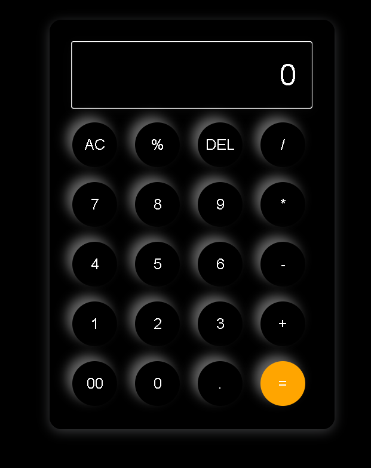

# Functional Calculator

This project is a functional and interactive calculator created using HTML, CSS, and JavaScript. It supports basic arithmetic operations, includes responsive design, and allows users to input numbers and operators both via buttons and keyboard.

## Features
- **Basic Operations:** Perform addition, subtraction, multiplication, and division.
- **Advanced Functionalities:** Includes clear (AC), delete (DEL), and percentage operations.
- **Responsive Design:** Adaptable layout for various screen sizes, making it suitable for both desktop and mobile use.
- **Keyboard Input Support:** Users can interact using both buttons and keyboard keys.
- **Error Handling:** Displays "Error" for invalid calculations, ensuring robustness.

## Technologies Used
- **HTML**: For the structure of the calculator.
- **CSS**: For styling and responsive design.
- **JavaScript**: For calculator functionalities and logic.

## Preview
 

## How to Use
1. Clone the repository:
   git clone https://github.com/itsalokbarnwal/functional-calculator-js.git
